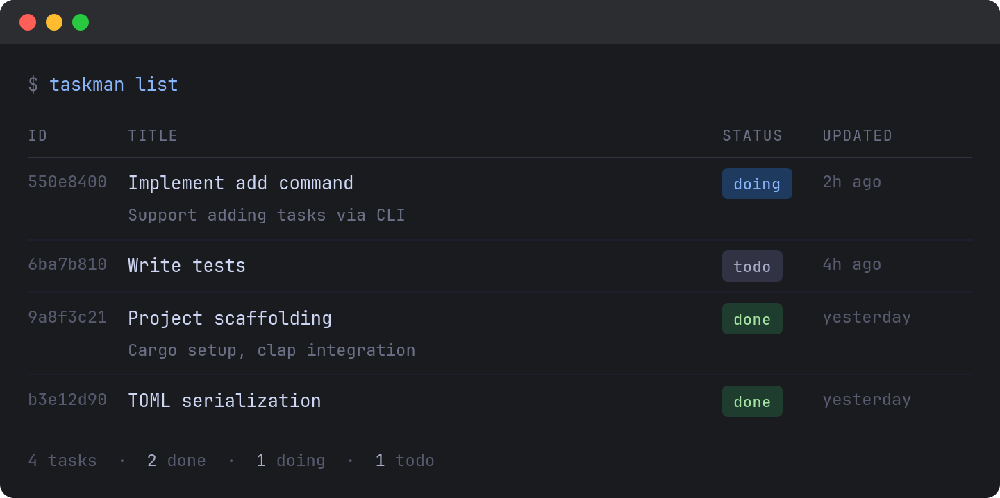

# Act

A simple, file-based CLI todo manager written in Rust. Tasks persist in a human-readable TOML file.

## Overview

Act stores tasks in `tasks.toml` in the current directory. Each task has a title, optional description, and one of three statuses: `todo`, `doing`, or `done`.

## Requirements

### Functional
- Initialize a new `tasks.toml` file
- Add tasks with title and optional description
- Edit task title/description
- Update task status (todo → doing → done)
- Delete tasks
- List tasks with filtering by status
- Show task details

### Non-Functional
- Single binary, no daemon
- Human-readable/editable TOML storage
- Clean terminal output with color coding
- Idempotent operations where possible
- No external runtime dependencies

## Data Model

```toml
# tasks.toml
[[task]]
id = "550e8400-e29b-41d4-a716-446655440000"
title = "Implement add command"
description = "Support adding tasks via CLI"
status = "doing"
created_at = "2026-04-21T09:00:00Z"
updated_at = "2026-04-21T11:00:00Z"

[[task]]
id = "6ba7b810-9dad-11d1-80b4-00c04fd430c8"
title = "Write tests"
status = "todo"
created_at = "2026-04-21T10:00:00Z"
updated_at = "2026-04-21T10:00:00Z"
```

## CLI Interface


- [x] act init                          # Create tasks.toml
- [ ] act add "Title" -d "Description"  # Add task
- [x] act list                          # List all tasks
- [ ] act list --status todo            # Filter by status
- [x] act show <id>                     # Show task details
- [ ] act edit <id> -t "New Title"      # Edit task
- [ ] act status <id> doing             # Update status
- [x] act delete <id>                   # Remove task


## Roadmap

### Milestone 1: Core (Week 1)
- [x] Project scaffolding (Cargo, CLI parsing with clap)
- [x] TOML serialization/deserialization (serde)
- [x] `init` and `add` commands
- [x] `list` with basic table output

### Milestone 2: CRUD (Week 2)
- [ ] `show`, `edit`, `status`, `delete` commands
- [ ] UUID generation for task IDs
- [ ] Timestamps (created_at, updated_at)
- [ ] Input validation

### Milestone 3: Polish (Week 3)
- [ ] Terminal colors (colored or similar)
- [ ] Status-based filtering
- [ ] Error handling with anyhow/thiserror
- [ ] Integration tests

### Milestone 4: Nice-to-Haves (Backlog)
- [ ] Task priorities
- [ ] Due dates
- [ ] Global config file (~/.config/act/)
- [ ] Export to JSON/CSV

## Tech Stack

| Component     | Crate            |
| ------------- | ---------------- |
| CLI parsing   | `clap`           |
| Serialization | `serde` + `toml` |
| IDs           | `uuid`           |
| Datetime      | `chrono`         |
| Colors        | `colored`        |
| Errors        | `anyhow`         |
| Tables        | `comfy-table`    |

## Project Structure

```
src/
├── main.rs       # CLI entry point
├── cli.rs        # Argument definitions (clap)
├── commands.rs   # Command handlers
├── storage.rs    # TOML read/write
└── models.rs     # Task struct, Status enum
```

## Success Criteria

- [ ] All CRUD operations work via CLI
- [ ] `tasks.toml` is human-readable and editable
- [ ] List view is scannable with color-coded statuses
- [ ] No panics on invalid input
- [ ] Single `cargo install` deployment

## Mockup

